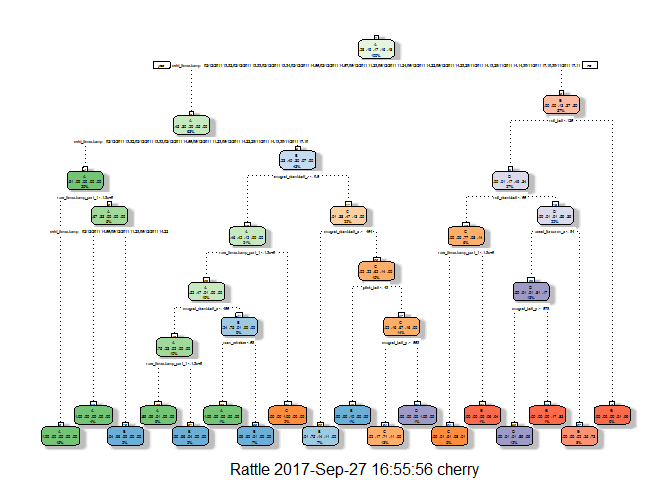
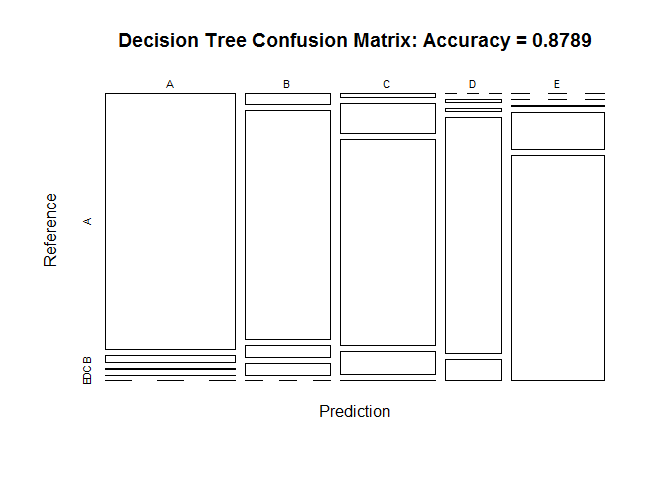
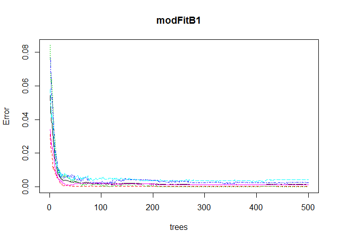
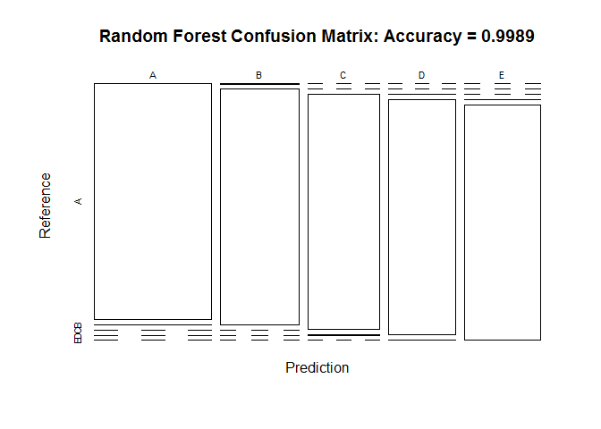

Project Introduction
====================

Background

Using devices such as Jawbone Up, Nike FuelBand, and Fitbit it is now
possible to collect a large amount of data about personal activity
relatively inexpensively. These type of devices are part of the
quantified self movement - a group of enthusiasts who take measurements
about themselves regularly to improve their health, to find patterns in
their behavior, or because they are tech geeks. One thing that people
regularly do is quantify how much of a particular activity they do, but
they rarely quantify how well they do it. In this project, your goal
will be to use data from accelerometers on the belt, forearm, arm, and
dumbell of 6 participants. They were asked to perform barbell lifts
correctly and incorrectly in 5 different ways. More information is
available from the website here:
<http://groupware.les.inf.puc-rio.br/har> (see the section on the Weight
Lifting Exercise Dataset).

Goal

The goal of your project is to predict the manner in which they did the
exercise. This is the "classe" variable in the training set. You may use
any of the other variables to predict with. You should create a report
describing how you built your model, how you used cross validation, what
you think the expected out of sample error is, and why you made the
choices you did. You will also use your prediction model to predict 20
different test cases.

Getting and loading the data
============================

    #install.packages("caret")
    library(caret)

    ## Loading required package: lattice

    ## Loading required package: ggplot2

    library(rpart)
    #install.packages("rpart.plot")
    library(rpart.plot)
    library(RColorBrewer)
    library(rattle)

    ## Rattle: A free graphical interface for data science with R.
    ## Version 5.1.0 Copyright (c) 2006-2017 Togaware Pty Ltd.
    ## Type 'rattle()' to shake, rattle, and roll your data.

    library(randomForest)

    ## randomForest 4.6-12

    ## Type rfNews() to see new features/changes/bug fixes.

    ## 
    ## Attaching package: 'randomForest'

    ## The following object is masked from 'package:rattle':
    ## 
    ##     importance

    ## The following object is masked from 'package:ggplot2':
    ## 
    ##     margin

    library(knitr)
    library(e1071)

    set.seed(12345)

    trainUrl <- "http://d396qusza40orc.cloudfront.net/predmachlearn/pml-training.csv"
    testUrl <- "http://d396qusza40orc.cloudfront.net/predmachlearn/pml-testing.csv"

    training <- read.csv(url(trainUrl), na.strings=c("NA","#DIV/0!",""))
    testing <- read.csv(url(testUrl), na.strings=c("NA","#DIV/0!",""))

Partioning the training set into two

    inTrain <- createDataPartition(training$classe, p=0.6, list=FALSE)
    myTraining <- training[inTrain, ]
    myTesting <- training[-inTrain, ]
    dim(myTraining); dim(myTesting)

    ## [1] 11776   160

    ## [1] 7846  160

Cleaning the data
=================

Remove NearZeroVariance variables

    nzv <- nearZeroVar(myTraining, saveMetrics=TRUE)
    myTraining <- myTraining[,nzv$nzv==FALSE]

    nzv<- nearZeroVar(myTesting,saveMetrics=TRUE)
    myTesting <- myTesting[,nzv$nzv==FALSE]

Remove the first column of the myTraining data set

    myTraining <- myTraining[c(-1)]

Clean variables with more than 60% NA

    trainingV3 <- myTraining
    for(i in 1:length(myTraining)) {
        if( sum( is.na( myTraining[, i] ) ) /nrow(myTraining) >= .7) {
            for(j in 1:length(trainingV3)) {
                if( length( grep(names(myTraining[i]), names(trainingV3)[j]) ) == 1)  {
                    trainingV3 <- trainingV3[ , -j]
                }   
            } 
        }
    }

    # Set back to the original variable name
    myTraining <- trainingV3
    rm(trainingV3)

Transform the myTesting and testing data sets

    clean1 <- colnames(myTraining)
    clean2 <- colnames(myTraining[, -58])  # remove the classe column
    myTesting <- myTesting[clean1]         # allow only variables in myTesting that are also in myTraining
    testing <- testing[clean2]             # allow only variables in testing that are also in myTraining

    dim(myTesting)

    ## [1] 7846   58

    dim(testing)

    ## [1] 20 57

Coerce the data into the same type

    for (i in 1:length(testing) ) {
        for(j in 1:length(myTraining)) {
            if( length( grep(names(myTraining[i]), names(testing)[j]) ) == 1)  {
                class(testing[j]) <- class(myTraining[i])
            }      
        }      
    }

    # To get the same class between testing and myTraining
    testing <- rbind(myTraining[2, -58] , testing)
    testing <- testing[-1,]

Prediction with Decision Trees
==============================

    set.seed(12345)
    modFitA1 <- rpart(classe ~ ., data=myTraining, method="class")
    fancyRpartPlot(modFitA1)

    predictionsA1 <- predict(modFitA1, myTesting, type = "class")
    cmtree <- confusionMatrix(predictionsA1, myTesting$classe)
    cmtree

    ## Confusion Matrix and Statistics
    ## 
    ##           Reference
    ## Prediction    A    B    C    D    E
    ##          A 2150   60    7    1    0
    ##          B   61 1260   69   64    0
    ##          C   21  188 1269  143    4
    ##          D    0   10   14  857   78
    ##          E    0    0    9  221 1360
    ## 
    ## Overall Statistics
    ##                                           
    ##                Accuracy : 0.8789          
    ##                  95% CI : (0.8715, 0.8861)
    ##     No Information Rate : 0.2845          
    ##     P-Value [Acc > NIR] : < 2.2e-16       
    ##                                           
    ##                   Kappa : 0.8468          
    ##  Mcnemar's Test P-Value : NA              
    ## 
    ## Statistics by Class:
    ## 
    ##                      Class: A Class: B Class: C Class: D Class: E
    ## Sensitivity            0.9633   0.8300   0.9276   0.6664   0.9431
    ## Specificity            0.9879   0.9693   0.9450   0.9845   0.9641
    ## Pos Pred Value         0.9693   0.8666   0.7809   0.8936   0.8553
    ## Neg Pred Value         0.9854   0.9596   0.9841   0.9377   0.9869
    ## Prevalence             0.2845   0.1935   0.1744   0.1639   0.1838
    ## Detection Rate         0.2740   0.1606   0.1617   0.1092   0.1733
    ## Detection Prevalence   0.2827   0.1853   0.2071   0.1222   0.2027
    ## Balanced Accuracy      0.9756   0.8997   0.9363   0.8254   0.9536

    plot(cmtree$table, col = cmtree$byClass, main = paste("Decision Tree Confusion Matrix: Accuracy =", round(cmtree$overall['Accuracy'], 4)))

\#Prediction with Random Forests

    set.seed(12345)
    modFitB1 <- randomForest(classe ~ ., data=myTraining)
    predictionB1 <- predict(modFitB1, myTesting, type = "class")
    cmrf <- confusionMatrix(predictionB1, myTesting$classe)
    cmrf

    ## Confusion Matrix and Statistics
    ## 
    ##           Reference
    ## Prediction    A    B    C    D    E
    ##          A 2231    2    0    0    0
    ##          B    1 1516    0    0    0
    ##          C    0    0 1367    3    0
    ##          D    0    0    1 1282    1
    ##          E    0    0    0    1 1441
    ## 
    ## Overall Statistics
    ##                                           
    ##                Accuracy : 0.9989          
    ##                  95% CI : (0.9978, 0.9995)
    ##     No Information Rate : 0.2845          
    ##     P-Value [Acc > NIR] : < 2.2e-16       
    ##                                           
    ##                   Kappa : 0.9985          
    ##  Mcnemar's Test P-Value : NA              
    ## 
    ## Statistics by Class:
    ## 
    ##                      Class: A Class: B Class: C Class: D Class: E
    ## Sensitivity            0.9996   0.9987   0.9993   0.9969   0.9993
    ## Specificity            0.9996   0.9998   0.9995   0.9997   0.9998
    ## Pos Pred Value         0.9991   0.9993   0.9978   0.9984   0.9993
    ## Neg Pred Value         0.9998   0.9997   0.9998   0.9994   0.9998
    ## Prevalence             0.2845   0.1935   0.1744   0.1639   0.1838
    ## Detection Rate         0.2843   0.1932   0.1742   0.1634   0.1837
    ## Detection Prevalence   0.2846   0.1933   0.1746   0.1637   0.1838
    ## Balanced Accuracy      0.9996   0.9993   0.9994   0.9983   0.9996

    plot(modFitB1)

    plot(cmrf$table, col = cmtree$byClass, main = paste("Random Forest Confusion Matrix: Accuracy =", round(cmrf$overall['Accuracy'], 4)))

Predicting Results on the Test Data
===================================

Random Forests gave an Accuracy in the myTesting dataset of 99.89%,
which was more accurate that what I got from the Decision Trees or GBM.
The expected out-of-sample error is 100-99.89 = 0.11%.

    predictionB2 <- predict(modFitB1, testing, type = "class")
    predictionB2

    ##  1  2 31  4  5  6  7  8  9 10 11 12 13 14 15 16 17 18 19 20 
    ##  B  A  B  A  A  E  D  B  A  A  B  C  B  A  E  E  A  B  B  B 
    ## Levels: A B C D E

    # Write the results to a text file for submission
    pml_write_files = function(x){
        n = length(x)
        for(i in 1:n){
            filename = paste0("problem_id_",i,".txt")
            write.table(x[i],file=filename,quote=FALSE,row.names=FALSE,col.names=FALSE)
        }
    }

    pml_write_files(predictionB2)
